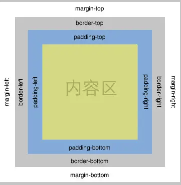

# CSS 盒模型

## 基本概念

所有 HTML 元素都可以视为一个盒子，该盒子包括：边距(margin)、边框(border)、填充(padding)和实际内容(content)



## 关于简写

```css
padding: 15px 12px; /* 第一个属性值表示上下填充 15px，第二个表示左右填充 12px */
padding: 14px 16px 17px; /* 第一个属性值表示上填充 14px，第二个表示左右填充 16px，第三个表示下填充 17px */
padding: 10px 20px 20px 30px; /* 上右下左 */
```

## 标准模型（W3C 模型）和 IE 模型

差异：宽高计算方式不同

标准模型：计算元素的宽高只算 content 的宽高  
IE 模型：计算元素的宽高包含 content 、padding、border(margin 的变化会影响整个盒子的大小)

## 如何设置两种模型

```css
div {
    // 设置标准模型
    box-sizing: content-box;
    // 设置IE模型
    box-sizing: border-box;
}
```

box-sizing 的默认值是 content-box

## JS 如何设置盒模型的宽高

假设已经获取节点 dom

```javascript
const myDom = document.getElementsById('one')

// 只能获取内联样式设置的宽高
myDom.style.width / height

// 获取渲染后即使运行的宽高，只支持IE
myDom.currentStyle.width / height

// 获取渲染后即时运行的宽高，兼容性很好
// 参考：https://www.runoob.com/w3cnote/window-getcomputedstyle-method.html
window.getComputedStyle(myDom, null).backgroundColor // 只能读取，不能设置，返回属性为驼峰形式
myDom.style.width = '500px' // 使用内联方式设置宽高

// 获取渲染后即使运行的宽高，兼容性很好，一般用来获取元素的绝对位置
myDom.getBoundingClientRect().width / height
```

## border-box 的妙用

在设置 padding 的时候，在默认的情况下很容易使 box 变大，从而破坏布局。  
为在设置 padding 时对整体布局不造成影响，可以使用`box-sizing: border-box;`
