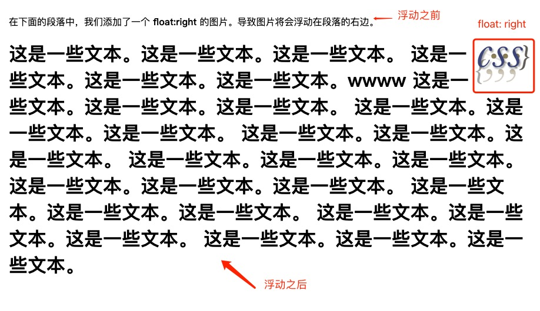

# 浮动的基础

浮动属性一旦被设置，那么就会按照浮动的方向移动，直到他的margin碰到包含块的padding/另一个浮动框为止。  
假设`box1{float:right;}`，那么在 box1 之前的元素不受浮动的影响，在 box1 之后的元素会围绕着 box1.



如果你把几个浮动的元素放到一起，如果有空间的话，它们将彼此相邻。如果没有空间的话，他会换行继续。


# 浮动与清除浮动

## 相关知识

### float 属性的取值

-   left：元素向左浮动
-   right：元素向右浮动
-   none：默认值，元素不会浮动，并会显示在其文本中出现的位置

### 特性

-   浮动元素会从普通文档流中脱离，但浮动元素影响的不仅是自己，它会影响周围的元素对其进行环绕；
-   不管一个元素是行内元素还是块级元素，只要被设置了浮动，那浮动元素就会形成一个块级框，可以设置它的宽度和高度，因此浮动元素常常用于制作横向配列的菜单，可以设置大小并且横向排列。
-   浮动属性一旦被设置，那么就会按照浮动的方向移动，直到他的margin碰到包含块的padding/另一个浮动框为止。

-   如果两个元素一个向左浮动，一个向右浮动，左浮动元素的 margin-right 不会和右元素的 margin-left 相邻
-   如果有多个浮动元素，浮动元素会按顺序排下来而不会发生重叠
-   如果有多个浮动元素，后面的元素高度不会超过前面的元素，并且不会超过包含块
-   如果有非浮动元素和浮动元素同时存在，并且非浮动元素在前，则浮动元素不会高于非浮动元素
-   浮动元素会尽可能地向顶端对齐、向左或向右对齐

### 重叠问题

-   行内元素与浮动元素发生重叠，其边框、背景和内容都会显示在浮动元素之上
-   块级元素与浮动元素发生重叠时，边框和背景会显示在浮动元素之下，内容会显示在浮动元素之下

### clear 属性

> 确保当前元素的左右两侧不会有浮动元素，clear 只对元素本身的布局起作用

-   left
-   right
-   both

## 父元素高度塌陷问题

> 为什么需要清除浮动

一个块级元素如果没有设置高度，其高度是由子元素撑开的。如果对子元素设置了浮动，那么子元素就会脱离文档流，也就是说父元素没有内容可以撑开其高度，这样父级元素的高度就会被忽略，这就是所谓的高度塌陷。

### 清除浮动的方法

1.  给父元素定义高度

    -   优点：操作简单
    -   缺点：高度定死

2.  添加一个空元素 `<div class="clear"></div> (.clear { clear: both })`

    -   优点：浏览器支持好
    -   缺点：凭空多出很多无用空节点

3.  让父元素也一起浮动

    -   缺点：无法解决实际问题

4.  父元素设置为 `display: table`

    -   缺点：会产生新的问题

5.  父元素设置 `overflow: hidden auto`

    -   缺点：无法显示溢出的元素

6.  父元素伪元素设置清除浮动

    ```css
    .father {
        ...;
    }
    
    .father:: after {
        content: ' ';
        display: block;
        height: 0;
        clear: both;
        visibility: hidden;
    }
    ```
