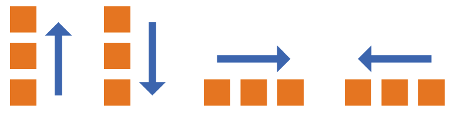
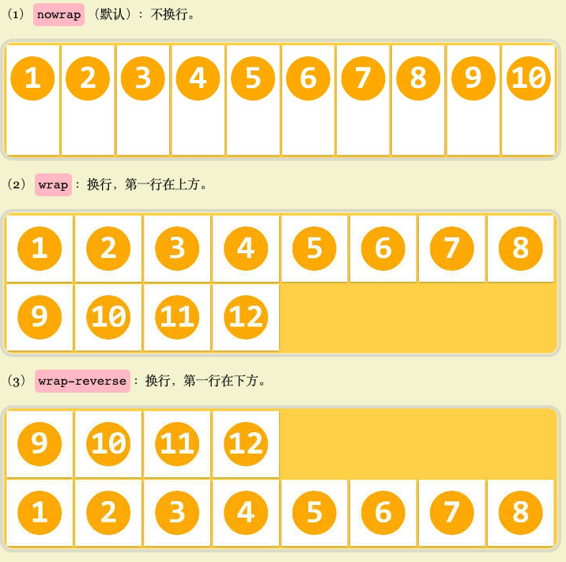
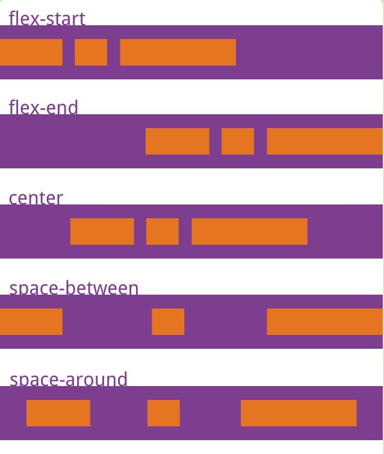
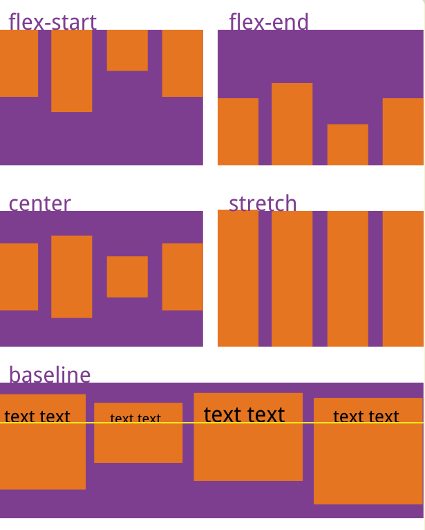

# Flex 布局

> 参考文章：  
> http://www.ruanyifeng.com/blog/2015/07/flex-grammar.> html  
> https://www.ruanyifeng.com/blog/2015/07/flex-examples.html

弹性布局，可以给盒状模型最大的灵活性  
`display: flex`  
行内元素也可以使用 flex 布局  
`display: inline-flex`  
webkit 内核的浏览器，需要加上-webkit 前缀

```
.box{
    dislay: -wibkit-flex;
    dislay: flex;
}
```

## flex 容器

指采用 flex 布局的元素

> 1. 两根轴：水平主轴 main axis；垂直交叉轴 cross axis
> 2. 开始和结束位置：main start、cross start
> 3. 宽：main size
> 4. 高：cross size

## 容器属性

即包裹小 item 的大 box

> flex-direction: 项目主轴排列方向  
> flex-wrap: 项目换行方式  
> flex-flow: flex-direction 属性和 flex-wrap 属性的简写形式，默认值为 row nowrap
> justify-content: 水平对齐方式  
> align-item: 垂直对齐方式  
> align-content: 整段对齐方式

### flex-direction 主轴方向

项目排列方向

-   row（默认值）：主轴为水平方向，起点在左端。
-   row-reverse：主轴为水平方向，起点在右端。
-   column：主轴为垂直方向，起点在上沿。
-   column-reverse：主轴为垂直方向，起点在下沿。



column-reverse ---- column ------------------- row ------------------- row-reverse

### flex-wrap

如何换行

1. no-wrap（默认）：不换行
2. wrap：向下换行
3. wrap-reverse：向上换行



### justify-content

main 轴线的对齐方式，

-   felx-start：左对齐
-   flex-end：右对齐
-   center：居中对齐
-   space-between：两端对齐，项目之间的间隔都相等。
-   space-around：每个项目两侧的间隔相等。所以，项目之间的间隔比项目与边框的间隔大一倍。



### align-items

垂直方向对齐方式

-   flex-start：交叉轴的起点对齐。
-   flex-end：交叉轴的终点对齐。
-   center：交叉轴的中点对齐。
-   baseline: 项目的第一行文字的基线对齐。
-   stretch（默认值）：如果项目未设置高度或设为 auto，将占满整个容器的高度。



### align-content

多轴线对齐


-   flex-start：与交叉轴的起点对齐。
-   flex-end：与交叉轴的终点对齐。
-   center：与交叉轴的中点对齐。
-   space-between：与交叉轴两端对齐，轴线之间的间隔平均分布。
-   space-around：每根轴线两侧的间隔都相等。所以，轴线之间的间隔比轴线与边框的间隔大一倍。
-   stretch（默认值）：轴线占满整个交叉轴。

## item 项目属性

> order: item 排序  
> flex-grow: 放大比例（瓜分剩余空间时每个 item 占比）  
> flex-shrink: 缩小比例  
> flex-basis: gorw 之前，mian 轴所占空间  
> flex: flex-grow、flex-shrink、flex-basis 简写  
> align-self: 单个 item 与父 box 的对齐方式不一样设置
